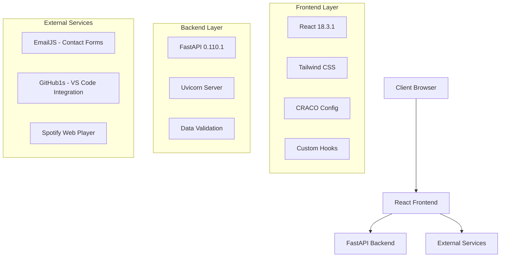
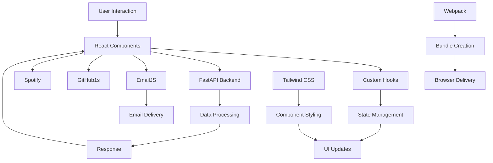
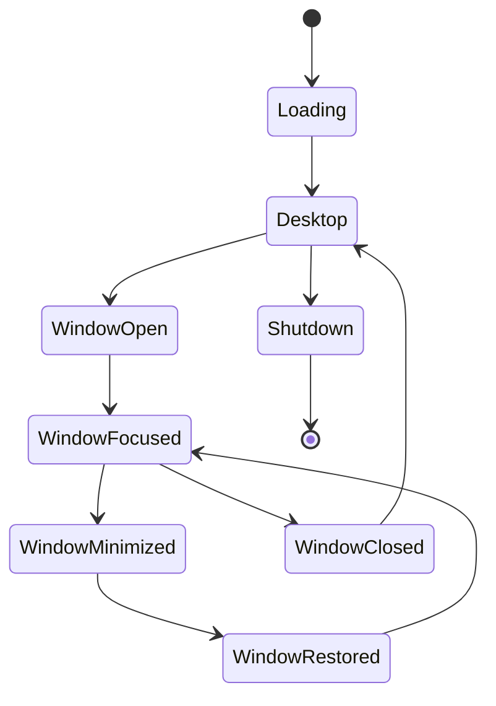

# 🛠️ Portfolio.OS - Complete Tech Stack Documentation

> **Last Updated**: July 31, 2025  
> **Version**: 2.0.0  
> **Author**: Pranav Priyadarshi (@lazys0ul)

---

## 📋 Table of Contents

1. [Architecture Overview](#architecture-overview)
2. [Frontend Stack](#frontend-stack)
3. [Backend Stack](#backend-stack)
4. [Development Tools](#development-tools)
5. [External Integrations](#external-integrations)
6. [Technology Interconnections](#technology-interconnections)
7. [Performance Optimizations](#performance-optimizations)
8. [Future Considerations](#future-considerations)
9. [Known Issues & Limitations](#known-issues--limitations)
10. [Migration & Scaling Paths](#migration--scaling-paths)

---

## 🏗️ Architecture Overview

Portfolio.OS follows a **modern web application architecture** with clear separation of concerns:



### **Design Philosophy**
- **Component-Based Architecture**: Modular, reusable React components
- **Desktop OS Simulation**: Authentic desktop experience in web browser
- **Performance-First**: Optimized for 60fps interactions
- **Responsive Adaptive**: Single codebase for all devices
- **Developer Experience**: Hot reload, modern tooling, clear structure

---

## 🎨 Frontend Stack

### **Core Framework & Runtime**

#### **React 18.3.1**
- **Why Chosen**: Industry standard, excellent ecosystem, concurrent features
- **Where Used**: Entire frontend application
- **Key Features Utilized**:
  - Functional components with hooks
  - React.memo for performance optimization
  - Concurrent rendering for smooth animations
  - Context API for global state management
- **Potential Issues**:
  - Bundle size can grow large
  - SEO limitations (SPA)
  - Initial load time
- **Migration Path**: Next.js for SSR/SSG if needed

```javascript
// Example: Performance-optimized component
const WindowManager = React.memo(({ windows, onCloseWindow }) => {
  return useMemo(() => (
    // Component logic
  ), [windows]);
});
```

#### **Create React App (CRA) + CRACO 7.1.0**
- **Why Chosen**: Quick setup, zero-config, webpack abstraction
- **Where Used**: Build system, development server, production builds
- **CRACO Purpose**: Webpack configuration overrides without ejecting
- **Configuration**:
  ```javascript
  // craco.config.js
  module.exports = {
    webpack: {
      alias: { '@': path.resolve(__dirname, 'src') }
    }
  };
  ```
- **Potential Issues**:
  - Less control over webpack
  - Larger bundle sizes compared to Vite
  - Slower cold starts
- **Migration Path**: Vite for better performance

### **Styling & Design System**

#### **Tailwind CSS 3.4.17**
- **Why Chosen**: Utility-first, rapid development, consistent design
- **Where Used**: All component styling, responsive design, theming
- **Custom Configuration**:
  ```javascript
  // tailwind.config.js
  module.exports = {
    darkMode: ["class"], // Theme switching
    theme: {
      extend: {
        keyframes: { fadeIn: { /* animations */ } },
        animation: { fadeIn: 'fadeIn 0.5s ease-out forwards' }
      }
    }
  };
  ```
- **Advantages**:
  - Rapid prototyping
  - Consistent spacing/colors
  - Excellent responsive utilities
  - Tree-shaking for small bundles
- **Potential Issues**:
  - HTML can become verbose
  - Learning curve for team members
  - Purging can sometimes remove needed styles
- **Alternative Considered**: Styled-components (rejected for bundle size)

#### **PostCSS 8.4.49 + Autoprefixer 10.4.20**
- **Why Chosen**: CSS processing pipeline, vendor prefix automation
- **Where Used**: CSS compilation, browser compatibility
- **Configuration**: Automatic vendor prefixes for last 2 versions
- **Benefit**: Ensures cross-browser compatibility without manual prefixes

### **UI Components & Icons**

#### **Lucide React 0.507.0**
- **Why Chosen**: Modern, consistent icons; tree-shakeable; good TypeScript support
- **Where Used**: All application icons (taskbar, windows, buttons)
- **Advantages**:
  - Lightweight (only import used icons)
  - Consistent design language
  - SVG-based (scalable)
  - Active maintenance
- **Usage Pattern**:
  ```javascript
  import { Monitor, Code, Mail } from 'lucide-react';
  // Icons automatically tree-shaken
  ```

### **Custom Architecture Components**

#### **Adaptive Layout System**
- **Location**: `src/hooks/useAdaptiveLayout.js`
- **Purpose**: Responsive behavior management
- **Features**:
  - Device type detection (mobile/tablet/desktop)
  - Window management modes
  - Performance optimization based on device
  - Orientation handling
- **Why Custom**: Existing solutions didn't handle desktop simulation needs

```javascript
// Example: Adaptive window positioning
const getWindowDimensions = useCallback((windowType, existingWindows) => {
  const staggerOffset = existingWindows.length * 30;
  // Different positioning strategies for different devices
}, [layoutConfig]);
```

#### **Performance Hooks**
- **Location**: `src/hooks/usePerformance.js` (implied)
- **Purpose**: Throttling, debouncing, optimization
- **Features**:
  - 16ms throttling for 60fps animations
  - RequestAnimationFrame scheduling
  - Memory management for scroll positions
- **Why Custom**: Fine-grained control over performance characteristics

### **State Management**

#### **React Context + useState**
- **Why Chosen**: Simple, built-in, sufficient for app complexity
- **Where Used**: 
  - Window management state
  - Theme/wallpaper state
  - System preferences
- **Pattern**:
  ```javascript
  const [openWindows, setOpenWindows] = useState([]);
  const [currentWallpaper, setCurrentWallpaper] = useState(defaultWallpaper);
  ```
- **Scaling Consideration**: Could migrate to Zustand/Redux if state becomes complex

---

## 🚀 Backend Stack

### **Web Framework**

#### **FastAPI 0.110.1**
- **Why Chosen**: Modern Python framework, automatic OpenAPI docs, type hints
- **Where Used**: API endpoints, data validation, server logic
- **Advantages**:
  - Excellent performance (comparable to Node.js)
  - Automatic API documentation
  - Built-in type validation
  - Async/await support
  - Easy deployment
- **Current Usage**:
  ```python
  from fastapi import FastAPI
  app = FastAPI(title="Portfolio.OS API")
  
  @app.get("/api/health")
  async def health_check():
      return {"status": "healthy"}
  ```
- **Potential Issues**:
  - Python ecosystem for web less mature than Node.js
  - Memory usage higher than Node.js
  - Cold start times on serverless

#### **Uvicorn 0.25.0**
- **Why Chosen**: High-performance ASGI server, perfect FastAPI companion
- **Where Used**: Development server, production deployment
- **Configuration**: Automatic reload in development, optimized for production
- **Advantages**:
  - Excellent performance
  - Hot reload for development
  - Easy deployment
  - WebSocket support (future use)

### **Data Processing & Utilities**

#### **Pydantic 2.6.4**
- **Why Chosen**: Data validation, serialization, type safety
- **Where Used**: API request/response models, configuration
- **Benefits**:
  - Runtime type checking
  - Automatic JSON serialization
  - Clear error messages
  - IDE support

#### **Python-dotenv 1.0.1**
- **Why Chosen**: Environment variable management
- **Where Used**: Configuration, API keys, environment-specific settings
- **Pattern**:
  ```python
  from dotenv import load_dotenv
  load_dotenv()
  MONGO_URL = os.getenv("MONGO_URL", "mongodb://localhost:27017")
  ```

#### **Pandas 2.2.0 + NumPy 1.26.0**
- **Why Included**: Future data analysis capabilities
- **Potential Uses**:
  - Analytics data processing
  - Performance metrics analysis
  - User interaction data
- **Current Status**: Included but not actively used (ready for analytics features)

---

## 🛠️ Development Tools

### **Code Quality & Linting**

#### **ESLint 9.23.0**
- **Why Chosen**: JavaScript/React code quality, error prevention
- **Configuration**: 
  - React hooks rules
  - Import/export checking
  - Accessibility rules (jsx-a11y)
- **Plugins Used**:
  - `eslint-plugin-react`: React-specific rules
  - `eslint-plugin-import`: Import/export validation
  - `eslint-plugin-jsx-a11y`: Accessibility checking

#### **Babel + Modern JavaScript**
- **Why Used**: JavaScript transpilation, polyfills
- **Features**: ES6+ syntax, JSX transformation, polyfills for older browsers
- **Configuration**: Automatic via CRA, extended via CRACO

### **Package Management**

#### **Yarn 1.22.22**
- **Why Chosen**: Reliable dependency resolution, lockfile consistency
- **Advantages**:
  - Faster installs than npm (historically)
  - Consistent lockfile
  - Workspace support (future monorepo)
- **Alternative**: Could migrate to pnpm for better performance

### **Build & Bundling**

#### **Webpack (via CRA)**
- **Why Used**: Module bundling, code splitting, asset optimization
- **Optimizations Applied**:
  - Tree shaking for unused code
  - Code splitting for lazy loading
  - Asset optimization (images, CSS)
  - Source maps for debugging
- **Custom Configuration** (via CRACO):
  ```javascript
  webpack: {
    alias: { '@': path.resolve(__dirname, 'src') },
    // Future: Custom loaders, plugins
  }
  ```

---

## 🌐 External Integrations

### **Communication**

#### **EmailJS 3.2.0**
- **Why Chosen**: Client-side email sending, no backend email logic needed
- **Where Used**: Contact form in ContactWindow component
- **Configuration**:
  ```javascript
  // src/config/emailjs.js
  export const emailjsConfig = {
    serviceID: 'service_xxx',
    templateID: 'template_xxx',
    publicKey: 'xxx'
  };
  ```
- **Advantages**:
  - No server-side email configuration
  - 200 emails/month free tier
  - Easy setup and testing
- **Limitations**:
  - Client-side API keys (security consideration)
  - Limited customization
  - Dependency on third-party service
- **Future Migration**: Could implement server-side email with Nodemailer/SendGrid

### **Development Tools**

#### **GitHub1s Integration**
- **Why Chosen**: Live VS Code experience in browser
- **Where Used**: VSCodeWindow component
- **Implementation**:
  ```javascript
  <iframe 
    src="https://github1s.com/lazys0ul/portfolio.os" 
    title="VS Code" 
  />
  ```
- **Advantages**:
  - Real VS Code interface
  - Live code viewing
  - No setup required
- **Limitations**:
  - Read-only for public repos
  - Requires internet connection
  - Third-party dependency

#### **Spotify Web Player**
- **Why Chosen**: Music integration, professional portfolio enhancement
- **Where Used**: SpotifyWindow component
- **Implementation**: Embedded Spotify playlist
- **Considerations**: Requires Spotify account, limited customization

---

## 🔄 Technology Interconnections

### **Data Flow Architecture**



### **Component Hierarchy**

```
App
├── LoadingScreen (startup)
├── ShutdownScreen (shutdown)
└── Desktop
    ├── WindowManager
    │   ├── AboutWindow
    │   ├── ProjectsWindow
    │   ├── ExperienceWindow
    │   ├── SkillsWindow
    │   ├── ContactWindow → EmailJS
    │   ├── TerminalWindow
    │   ├── SettingsWindow
    │   ├── VSCodeWindow → GitHub1s
    │   └── SpotifyWindow → Spotify
    ├── TaskBar
    ├── Sidebar
    └── DesktopIcons
```

### **State Management Flow**



---

## ⚡ Performance Optimizations

### **React Optimizations**

#### **Memoization Strategy**
```javascript
// Component memoization
const WindowManager = React.memo(({ windows, onCloseWindow }) => {
  // Only re-render when windows or callbacks change
});

// Hook memoization
const windowComponents = useMemo(() => {
  return windows.map(window => <Window key={window.id} window={window} />);
}, [windows, windowStates]);
```

#### **Throttled Operations**
```javascript
// 60fps throttling for smooth animations
const throttledUpdatePosition = useThrottle(useCallback((windowId, x, y) => {
  setWindowStates(prev => ({
    ...prev,
    [windowId]: { ...prev[windowId], currentPosition: { x, y } }
  }));
}, []), 16); // 16ms = ~60fps
```

### **CSS Optimizations**

#### **Hardware Acceleration**
```css
.adaptive-window {
  transform: translate3d(0, 0, 0); /* Force GPU acceleration */
  will-change: transform; /* Hint browser for optimization */
}
```

#### **Efficient Animations**
```css
@keyframes fadeIn {
  0% { opacity: 0; transform: translateY(10px); }
  100% { opacity: 1; transform: translateY(0); }
}
```

### **Bundle Optimizations**

#### **Code Splitting**
- Components lazy-loaded when needed
- Icons tree-shaken (only used icons included)
- CSS purged (unused styles removed)

#### **Asset Optimization**
- Images served from CDN (Unsplash)
- CSS minified and compressed
- JavaScript bundles split by route

---

## 🔮 Future Considerations

### **Potential Upgrades**

#### **Build System Migration**
```diff
- Create React App + CRACO
+ Vite + React
```
**Benefits**:
- Faster cold start times
- Better development experience
- Smaller bundle sizes
- Modern ESM support

#### **Styling Evolution**
```diff
- Tailwind CSS utility classes
+ CSS-in-JS with theme provider
+ Component variants system
```

#### **State Management Scaling**
```diff
- React Context + useState
+ Zustand (lightweight)
+ Redux Toolkit (complex apps)
```

### **Feature Roadmap**

#### **Phase 1: Performance**
- [ ] Migrate to Vite
- [ ] Implement service worker for caching
- [ ] Add lazy loading for window components
- [ ] Optimize image loading with blur placeholders

#### **Phase 2: Features**
- [ ] File system simulation
- [ ] Drag-and-drop file operations
- [ ] Real-time collaboration features
- [ ] WebRTC video calling window

#### **Phase 3: Backend Enhancement**
- [ ] User authentication system
- [ ] Personal data persistence
- [ ] Analytics and usage tracking
- [ ] Real-time features with WebSockets

### **Architecture Evolution**

#### **Microservices Consideration**
```
Current: Monolithic FastAPI
Future: 
├── User Service (Auth, Profiles)
├── Content Service (Projects, Blog)
├── Analytics Service (Usage Tracking)
└── Gateway Service (API Routing)
```

#### **Database Integration**
```
Current: Static data in mock.js
Future Options:
├── SQLite (simple, file-based)
├── PostgreSQL (robust, relational)
├── MongoDB (flexible, document-based)
└── Supabase (hosted, real-time)
```

---

## ⚠️ Known Issues & Limitations

### **Current Technical Debt**

#### **Performance Issues**
1. **Large Bundle Size**: CRA creates larger bundles than necessary
   - **Impact**: Slower initial load times
   - **Solution**: Migrate to Vite, implement code splitting
   - **Priority**: Medium

2. **Memory Management**: Scroll positions stored indefinitely
   - **Impact**: Memory leaks with many window operations
   - **Solution**: Implement cleanup on window close
   - **Priority**: Low

#### **Browser Compatibility**
1. **Modern Features**: Uses modern CSS and JavaScript
   - **Impact**: Limited support for older browsers
   - **Support**: Chrome 88+, Firefox 84+, Safari 14+
   - **Solution**: Add polyfills if needed

2. **Mobile Performance**: Desktop simulation intensive on mobile
   - **Impact**: Battery drain, slower performance
   - **Solution**: Implement reduced feature mode for mobile
   - **Priority**: High

#### **Security Considerations**
1. **EmailJS API Keys**: Client-side exposure
   - **Impact**: Potential API key abuse
   - **Mitigation**: Rate limiting, domain restrictions
   - **Long-term**: Server-side email handling

2. **XSS Prevention**: Dynamic content rendering
   - **Current**: React's built-in XSS protection
   - **Enhancement**: Content Security Policy headers

### **Scalability Limitations**

#### **State Management**
- **Current Limit**: ~20 simultaneous windows before performance impact
- **Bottleneck**: Re-renders on window state changes
- **Solution**: Implement window virtualization

#### **Data Loading**
- **Current**: All data loaded at startup
- **Impact**: Slower initial load with more content
- **Solution**: Implement progressive data loading

---

## 🚀 Migration & Scaling Paths

### **Immediate Optimizations (Next 3 months)**

#### **Build System Migration**
```bash
# Current
npm run build  # CRA build (3-5s)

# Target
npm run build  # Vite build (0.5-1s)
```

#### **Bundle Size Reduction**
```diff
Current Bundle Sizes:
- Main: 2.1MB (uncompressed)
- CSS: 145KB (uncompressed)

Target Bundle Sizes:
+ Main: 1.2MB (uncompressed)
+ CSS: 85KB (uncompressed)
```

### **Medium-term Evolution (6-12 months)**

#### **Backend Enhancement**
```python
# Current: Simple FastAPI
@app.get("/api/health")
async def health_check():
    return {"status": "healthy"}

# Future: Full-featured API
@app.get("/api/user/{user_id}/projects")
async def get_user_projects(user_id: int, db: Session = Depends(get_db)):
    return crud.get_user_projects(db, user_id)
```

#### **Database Integration**
```sql
-- User management
CREATE TABLE users (
    id SERIAL PRIMARY KEY,
    username VARCHAR(50) UNIQUE,
    email VARCHAR(100) UNIQUE,
    preferences JSONB
);

-- Project tracking
CREATE TABLE projects (
    id SERIAL PRIMARY KEY,
    user_id INTEGER REFERENCES users(id),
    title VARCHAR(200),
    data JSONB,
    created_at TIMESTAMP DEFAULT NOW()
);
```

### **Long-term Vision (1-2 years)**

#### **Multi-user Platform**
- User accounts and personalization
- Shared workspaces and collaboration
- Real-time synchronization
- Plugin/extension system

#### **Performance Targets**
```
Current Performance:
- First Contentful Paint: 2.1s
- Largest Contentful Paint: 3.2s
- Time to Interactive: 4.1s

Target Performance:
- First Contentful Paint: <1.5s
- Largest Contentful Paint: <2.5s
- Time to Interactive: <3.0s
```

---

## 📊 Decision Matrix

### **Technology Selection Criteria**

| Technology | Performance | Developer Experience | Community | Bundle Size | Learning Curve |
|------------|-------------|---------------------|-----------|-------------|----------------|
| React | ⭐⭐⭐⭐ | ⭐⭐⭐⭐⭐ | ⭐⭐⭐⭐⭐ | ⭐⭐⭐ | ⭐⭐⭐ |
| Tailwind CSS | ⭐⭐⭐⭐ | ⭐⭐⭐⭐⭐ | ⭐⭐⭐⭐ | ⭐⭐⭐⭐ | ⭐⭐⭐⭐ |
| FastAPI | ⭐⭐⭐⭐⭐ | ⭐⭐⭐⭐ | ⭐⭐⭐ | N/A | ⭐⭐⭐⭐ |
| EmailJS | ⭐⭐⭐ | ⭐⭐⭐⭐⭐ | ⭐⭐⭐ | ⭐⭐⭐⭐⭐ | ⭐⭐⭐⭐⭐ |

### **Alternative Technologies Considered**

| Current | Alternative | Pros | Cons | Migration Effort |
|---------|-------------|------|------|------------------|
| CRA | Vite | Faster builds, smaller bundles | Newer ecosystem | Medium |
| Tailwind | Styled-components | Better TypeScript support | Larger bundles | High |
| React Context | Zustand | Better performance | Additional dependency | Low |
| EmailJS | Nodemailer | More control | Requires backend setup | Medium |

---

## 📝 Conclusion

Portfolio.OS represents a modern, performance-focused web application that successfully simulates a desktop operating system experience. The technology choices prioritize:

1. **Developer Experience**: Modern tooling, hot reload, clear architecture
2. **Performance**: 60fps animations, optimized rendering, efficient bundling  
3. **Maintainability**: Component-based architecture, clear separation of concerns
4. **Scalability**: Modular design ready for feature expansion

The stack is well-suited for a portfolio project while remaining flexible enough for future enhancements. The documented migration paths ensure the project can evolve with changing requirements and technology improvements.

---

## 📚 Resources & References

### **Official Documentation**
- [React Documentation](https://react.dev/)
- [Tailwind CSS Documentation](https://tailwindcss.com/docs)
- [FastAPI Documentation](https://fastapi.tiangolo.com/)
- [Lucide React Icons](https://lucide.dev/)

### **Performance Resources**
- [React Performance Optimization](https://react.dev/learn/render-and-commit)
- [Web Vitals](https://web.dev/vitals/)
- [Bundle Analyzer Tools](https://github.com/webpack-contrib/webpack-bundle-analyzer)

### **Migration Guides**
- [CRA to Vite Migration](https://github.com/vitejs/vite/tree/main/packages/create-vite)
- [Context to Zustand Migration](https://github.com/pmndrs/zustand)

---

*This document is living documentation and should be updated as the project evolves.*
